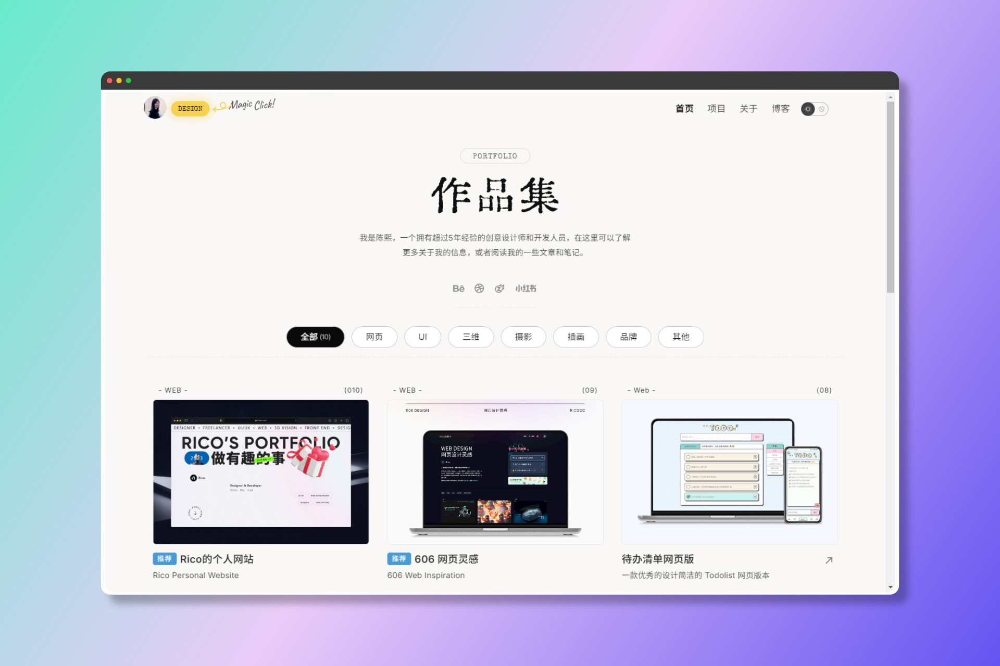

# 设计师的个人网站 Designer Portfolio Site - Astro.js

### 网站预览
预览模板地址:  <a href="https://blog-template.606design.art/" target="_blank">https://blog-template.606design.art/</a>

仓库地址:   <a href="https://github.com/ricocc/public-portfolio-site" target="_blank"> https://github.com/ricocc/public-portfolio-site </a>



---


### 技术栈

- Astro.js 4.15.9
- Sass 1.79.4
- typescript: 5.6.2

---
  
### 字体选择

中文标题字体： 汇文明朝体 <a href="https://tieba.baidu.com/p/7193815211" target="_blank">官方链接</a>

正文字体：思源黑体 <a href="https://fonts.google.com/noto/specimen/Noto+Sans+SC?query=Noto+sans+sc" target="_blank">Google Font</a>

英文字体：Special Elite   <a href="https://fonts.google.com/specimen/Special+Elite" target="_blank">Google Font</a>

中文字题由于体量过大，所以其中的标题，我选择了转化为 SVG 的格式嵌入。可以自行下载字体，再转化格式替换。

---

### 基础用法说明
#### Data 网站主要信息
 主要的网站信息，主要集中在 `src/data/` 下面，可以通过修改这几个文件中的数据来修改为自己的网站，
 - `content.ts` 网站的基本信息，包括联系方式、导航、TDK 等
 - `project.ts` 项目信息，主要展示在项目列表中，但是具体的项目详细页面，需要手动创建
 - `home.json` 首页展示的作品列表，可选择展示的内容信息比较多
 About 页面需要手动添加自己的个人介绍，博客内容，只需要在 `content/blog/*`文件夹下面添加 markdown 文件即可, 按照固定格式，博客列表会自动添加标题和路径


 网站主要信息存放在  `src/data/content.ts`
 修改里面对应的数据即可
 部分需要在页面中手动修改


#### Index页面项目展示
项目数据存放地址在
`src/data/home.json`

```Typescript
[
	{
		"id": "1",
		"cover": "/assets/cover/cover-todo.jpg",
		"title": "待办清单网页版",
		"desc": "一款优秀的设计简洁的 Todolist 网页版本",
		"url": "https://todo.606design.art/",
		"detail": "/detail/todo",
		"category": "web",
		"tag": "Web",
		"date": "2023-07-05",
		"mark": true,
	},
]
```
```Typescript
		"id" // 项目id  可选填
		"title"  //项目名称  必填
		"cover"  // 项目封面图片  可选填
		"desc" // 项目描述  可选填
		"url" /// 项目地址  可选填
		"detail" // 项目详细介绍页面路径  可选填
		"category" // 项目分类 可选填, 为空则默认分类到 other
		"tag" // 项目标签 可选填, 建议一定要填写
		"date" // 项目创建时间 可选填
		"mark" // 是否显示推荐标签  可选填 默认 false
```

#### 项目列表

项目 `/project`

```Typescript
export interface ProjectItem {
	id?: number; // 唯一标识符
	title: string // 项目名称
	title_en?: string //英文项目名称
	description?: string  // 项目描述
	date?: string		//发布日期
	detail?: string //详细页路径
  url?: string  //上线链接
	tags?: string[] //标签
	cover?: string[] //封面
}
```

#### 项目详细介绍
具体项目内容需要新建页面*.astro，手动存档，url 在project.json 的 `detail` 属性对应填写, 不填写的话，首页项目没有链接
`src/pages/detail/`

---

### 🚀 项目结构

Inside of your Astro project, you'll see the following folders and files:

```
/
├── public/
│   ├── images/
│   ├── logo.svg
│   ├── favicon.ico
│   └── ...
├── src/
│   ├── assets/
│   │   └── *Layout.astro*
│   ├── components/
│   │   ├── *
│   ├── layouts/
│   │   └── Layout.astro
│   ├── content/
│   │   └── *
│   ├── data/
│   │   ├── content.ts
│   │   ├── project.ts
│   │   └── home.json
│   ├── effets/
│   │   └── *.astro
│   ├── layouts/
│   │   └── Layout.astro
│   └── pages/
│       ├── index.astro
│       ├── about.astro
│       ├── project.astro
│       ├── blog.astro
│       └── 404.astro
├── package.json
```

---

### 🧞 启动

All commands are run from the root of the project, from a terminal:

| Command                | Action                                           |
| :--------------------- | :----------------------------------------------- |
| `npm install`          | Installs dependencies                            |
| `npm run dev`          | Starts local dev server at `localhost:4321`      |
| `npm run build`        | Build your production site to `./dist/`          |
| `npm run preview`      | Preview your build locally, before deploying     |
| `npm run astro ...`    | Run CLI commands like `astro add`, `astro check` |
| `npm run astro --help` | Get help using the Astro CLI                     |


Yarn Command:

| Command                | Action                                           |
| :--------------------- | :----------------------------------------------- |
| `yarn install`         | Installs dependencies                            |
| `yarn dev`             | Starts local dev server at `localhost:4321`      |
| `yarn build`           | Build your production site to `./dist/`          |
| `yarn preview`         | Preview your build locally, before deploying     |
| `yarn astro ...`       | Run CLI commands like `astro add`, `astro check` |
| `yarn astro --help`    | Get help using the Astro CLI                     |

---

### 后续

 这是初步的尝试，后面会继续完善。是否添加 Headless CMS 来进行管理，还在考虑中。
 
---

### 关于作者

我是 Rico， 目标是成为一个优秀的设计师和创意开发者，目前专注于网页视觉的技术实现，也研究研究 3D，建建站。目前我在积极的创作一些作品，做有趣和创意性的东西。有兴趣的话，也可以关注一下我的小红书 [@Rico的设计漫想](https://www.xiaohongshu.com/user/profile/5f2b6903000000000101f51f)，或者通过邮件联系我: hello@606design.art。

#### Social Media
- 主题网站地址：  <a href="https://blog.ricocc.com/" target="_blank">Ricocc Blog - blog.ricocc.com</a>
- 小红书：  <a href="https://www.xiaohongshu.com/user/profile/5f2b6903000000000101f51f" target="_blank">@Rico的设计漫想</a>
- 站酷：<a href="https://ricocc.zcool.com.cn/?ref=openBlog" target="_blank">Ricocc</a>
- Dribbble： <a href="https://dribbble.com/rrrricocc" target="_blank">Ricocc</a>

---

### 💜支持作者


如果觉得有所帮助的话，一点点支持就可以大大激励创作者的热情，感谢！


